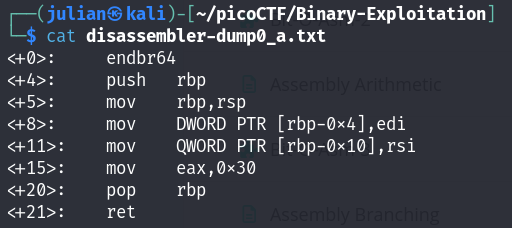
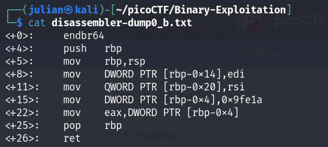
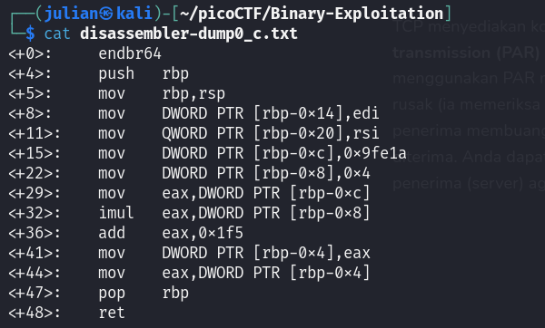
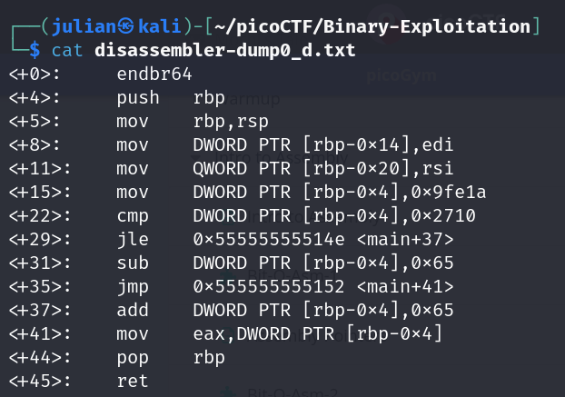

# Bit-O-Asm-1

### Deskripsi

Dapatkah Anda mengetahui apa yang ada di dalam register eax? Masukkan jawaban Anda ke dalam format flag picoCTF: picoCTF{n} di mana n adalah isi dari register eax dalam basis bilangan desimal. Jika jawabannya adalah 0x11, maka flag Anda adalah picoCTF{17}. Unduh assembly dump-nya [here](https://artifacts.picoctf.net/c/509/disassembler-dump0_a.txt).

### Langkah-langkah

#### Download file

gunakan perintah `wget`

- `wget link_address`

#### Baca file

gunakan perintah `cat`

- `cat file_name`

- Dapat kita lihat bahwa isi dari register `eax` adalah `0x30`.
- Ubah dari hexa ke desimal, bisa manual atau menggunakan python.
- Nilai desimalnya adalah: `48`.

---

# Bit-O-Asm-2

### Deskripsi

Dapatkah Anda mengetahui apa yang ada di dalam register eax? Masukkan jawaban Anda ke dalam format flag picoCTF: picoCTF{n} di mana n adalah isi dari register eax dalam basis bilangan desimal. Jika jawabannya adalah 0x11, maka flag Anda adalah picoCTF{17}. Unduh assembly dump-nya [here](https://artifacts.picoctf.net/c/510/disassembler-dump0_b.txt).

### Langkah-langkah

#### Download file

gunakan perintah `wget`

- `wget link_address`

#### Baca file

gunakan perintah `cat`

- `cat file_name`

- Dapat kita lihat bahwa isi dari register `eax` adalah isi dari DWORD PTR [rbp-0x4]. isi dari DWORD PTR [rbp-0x4] sendiri adalah `0x9fe1a`.
- Ubah `0x9fe1a` kedalam desimal.
- Nilai desimalnya adalah: `654874`.

---

# Bit-O-Asm-3

### Deskripsi

Dapatkah Anda mengetahui apa yang ada di dalam register eax? Masukkan jawaban Anda ke dalam format flag picoCTF: picoCTF{n} di mana n adalah isi dari register eax dalam basis bilangan desimal. Jika jawabannya adalah 0x11, maka flag Anda adalah picoCTF{17}. Unduh assembly dump-nya [here](https://artifacts.picoctf.net/c/530/disassembler-dump0_c.txt).

#### Download file

gunakan perintah `wget`

- `wget link_address`

#### Baca file

gunakan perintah `cat`

- `cat file_name`

  

- Catat semua yang diketahui.
- `DWORD PTR [rbp-0xc]` bernilai `0x9fe1a`.
- `DWORD PTR [rbp-0x8]` bernilai `0x4`.
- Masukkan nilai `DWORD PTR [rbp-0xc]` ke dalam register `eax`.
  nlai `eax` sekarang adalah 654874.
- `imul` kalikan nilai `eax` dengan `DWORD PTR [rbp-0x8]`. nilai `eax` setelah di kali menjadi `2619496`.
- Tambahkan `eax` dengan `0x1f5`
- Nilai `eax` adalah `2619997`.

---

# Bit-O-Asm-4

### Deskripsi

Dapatkah Anda mengetahui apa yang ada di dalam register eax? Masukkan jawaban Anda ke dalam format flag picoCTF: picoCTF{n} di mana n adalah isi dari register eax dalam basis bilangan desimal. Jika jawabannya adalah 0x11, maka flag Anda adalah picoCTF{17}. Unduh assembly dump-nya [here](https://artifacts.picoctf.net/c/511/disassembler-dump0_d.txt).

#### Download file

gunakan perintah `wget`

- `wget link_address`

#### Baca file

gunakan perintah `cat`

- `cat file_name`

- Catat semua yang diketahui.
- `DWORD PTR [rbp-0x4]` bernilai `0x9fe1a`. Dalam desimal adalah `654874`
- `cmp` bandingkan antara `DWORD PTR [rbp-0x4]` dengan `0x2710`. Karena tidak sama, flag `jle` tidak terpenuhi, sehingga tidak melompat ke `<+37>`, dan eksekusi lanju ke `<+31>`.
- `sub` kurangi nilai `DWORD PTR [rbp-0x4]` dengan `0x65`. maka nilai nya sekarang adalah `654773`
- masukkan nilai `DWORD PTR [rbp-0x4]` ke dalam `eax`.
- Hasil akhir untuk `eax` adalah `654773`
