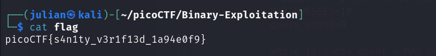
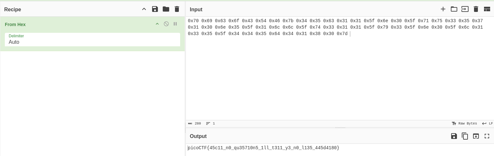
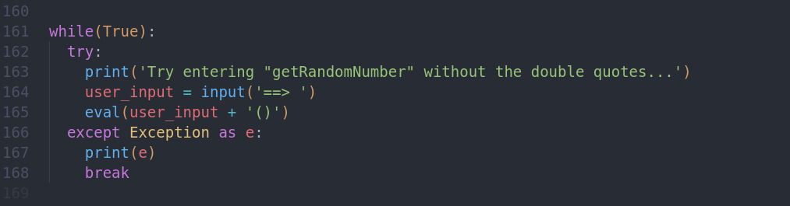
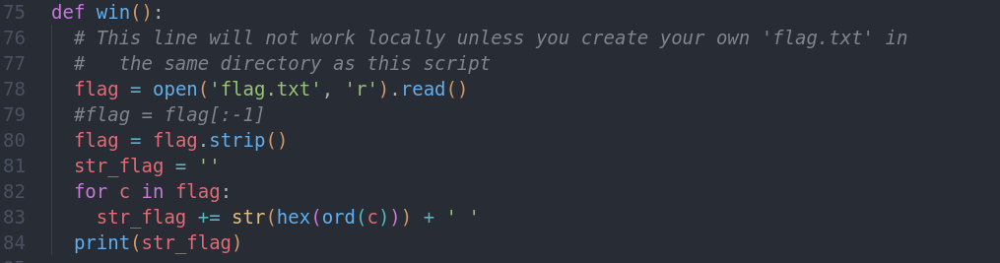
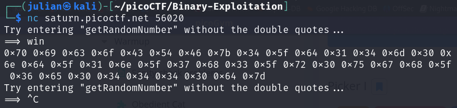

# Obedient Cat

## Deskripsi

File ini memiliki flag yang terlihat jelas (alias "in-the-clear"). [Download flag](https://mercury.picoctf.net/static/704f877da185904ec3992e7255a15c6c/flag).

## Langkah-langkah

#### Download file

gunakan perintah `wget`

- `wget link_address`

#### Baca file

gunakan perintah `cat`

- `cat flag`

---

# Warmed Up

## Deskripsi

Apa yang dimaksud dengan 0x3D (basis 16) dalam desimal (basis 10)?

`0x3D` -> `(3 * 16^1) + (13 * 16^0)`

maka `0x3D` dalam desimal adalah: `61`

---

# ASCII Numbers

## Deskripsi

Konversikan deretan angka ASCII berikut ini menjadi deretan yang dapat dibaca:

`0x70 0x69 0x63 0x6f 0x43 0x54 0x46 0x7b 0x34 0x35 0x63 0x31 0x31 0x5f 0x6e 0x30 0x5f 0x71 0x75 0x33 0x35 0x37 0x31 0x30 0x6e 0x35 0x5f 0x31 0x6c 0x6c 0x6c 0x5f 0x74 0x33 0x31 0x31 0x5f 0x79 0x33 0x5f 0x6e 0x30 0x5f 0x6c 0x31 0x33 0x35 0x5f 0x34 0x34 0x35 0x64 0x34 0x31 0x38 0x30 0x7d`

## Langkah-langkah

- Gunakan situs [CyberChef](https://gchq.github.io/CyberChef/) untuk mengubah hex to ASCII

---

# Picker I

## Deskripsi

Layanan ini dapat memberi Anda nomor acak, tetapi dapatkah layanan ini melakukan hal lain? Detail tambahan akan tersedia setelah meluncurkan contoh tantangan Anda.
Sambungkan ke program dengan netcat: $ nc saturn.picoctf.net 58970 Kode sumber program dapat diunduh [here](https://artifacts.picoctf.net/c/514/picker-I.py)

## Langkah-langkah

#### Download file

gunakan perintah `wget`

- `wget link_address`

#### Buka file

gunakan perintah `code`
`

- `code nama_file`

- pada `eval(user_input + '()')` dapat kita manfaatkan untuk masuk ke fungsi yang ada dalam file.

- kita akan coba menggunakan fungsi `win()` untuk mengakses `flag.txt`
- sambungkan menggunakan netcat

- kita akan mendapatkan sejumlah nilai hexadesimal.
- Gunakan situs [CyberChef](https://gchq.github.io/CyberChef/) untuk mengubah hex to ASCII.
